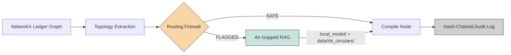
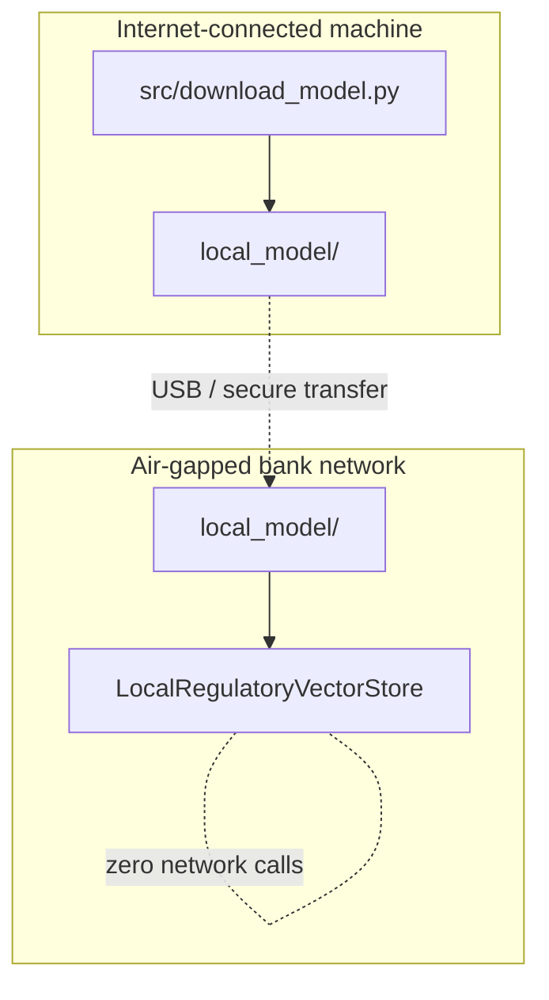

# GAAD: Graph Anomaly Agentic Dossier Pipeline

Deterministic middleware that turns bank transaction-graph anomaly scores into audit-ready, RBI-cited compliance reports, fully air-gapped. No generative LLM in the loop. Every decision is reproducible and independently re-verifiable.

## Architecture



| Stage | What it does | Cost profile |
|---|---|---|
| Topology Extraction | Computes clustering coefficient, shared-device count, bidirectional velocity per account | Cheap, runs on every account |
| Routing Firewall | Deterministic threshold rule. `SAFE` → stop here. `FLAGGED` → escalate | Kills ~85%+ of accounts before any retrieval cost |
| Air-Gapped RAG | `sentence-transformers` cosine search, `FLAGGED` accounts only, zero network calls | Only paid for accounts that need it |
| Compile + Audit Log | Runs on every account unconditionally, SHA-256 hash-chained JSONL | Persist once, tamper-evident forever |

## Verified Results

| Metric | Score | What it actually proves |
|---|---|---|
| Context Grounding | **100%** (9/9 citations, 0 hallucinated) | Structural guarantee: retrieval can only return citations that exist on disk |
| Topological Accuracy | **100%** (F1 = 1.0, TP=3 FP=0 FN=0) | Plumbing is bug-free vs. a synthetic planted benchmark, **not** a real-world detection claim |
| Malformed Input Fuzzer | **6/6 caught** | Negative amounts, self-loops, NaN scores, empty device IDs, corrupted nodes, all raise typed errors, zero raw crashes |

<details>
<summary>Raw eval_suite.py output</summary>

```
Confusion matrix:        TP=3 FP=0 TN=16 FN=0
Precision / Recall / F1: 1.000 / 1.000 / 1.000
Context Grounding Score: 100.0% (9/9 citations verified, 0 hallucinated)
Topological Accuracy:    100.0% (SYNTHETIC labels, see scoping note in source)
```
</details>

## Known Vulnerability (found by our own adversarial suite, unpatched)

**A hub-and-device-rotation attack bypasses the firewall.**


Velocity signal correctly sees the full 3-hop chain. Device signal returns zero shared devices (attacker rotated devices at the flagged hop). The firewall's rule is a **hard AND-gate**: no device match = no escalation, regardless of velocity strength. Verdict: `SAFE`. This is a false negative.

**Fix (not yet applied):** replace the AND-gate with a weighted rule, e.g. `device_signal OR (velocity_hops AND velocity_speed)`, and extend device-linkage checks to an N-hop neighborhood instead of immediate neighbors only.

<details>
<summary>Raw adversarial finding</summary>

```json
{
  "firewall_verdict": "SAFE",
  "shared_device_account_count": 0,
  "max_multi_hop_velocity_hops": 3,
  "is_false_negative": true
}
```
</details>

## Deployment



- **Phase 1 (online, once):** `python src/download_model.py` downloads `all-MiniLM-L6-v2` to `./local_model/`.
- **Phase 2 (offline, forever):** the vector store loads only from that local path. Missing directory = hard fail with remediation instructions, never a silent download.

## Regulatory Data: Zero Code Coupling

```
data/rbi_circulars/*.json  →  legal team edits this, only this
```

No clause, section number, or legal text is hardcoded anywhere in application code. Swap the JSON files, restart, done. Every file carries `"verified_real_text": false` until legal signs off. Any audit record built from unverified text automatically gets a `SYSTEM_AUDIT_WARNING` key, injected deterministically before persistence, on every account path, unconditionally. It cannot be skipped.
